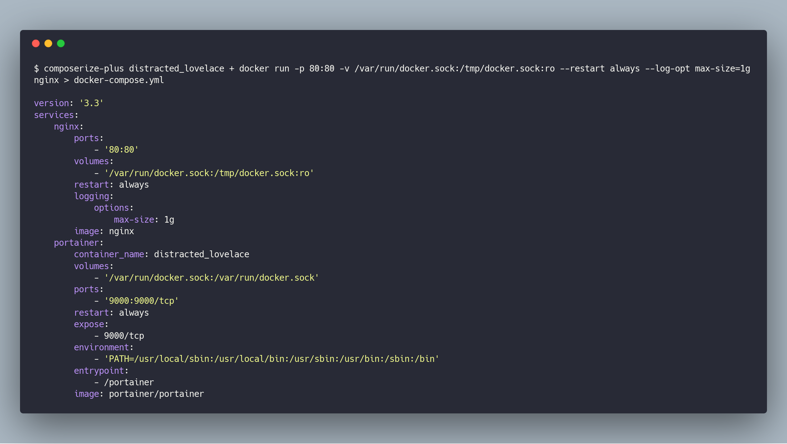

# composerize-plus

[](https://www.npmjs.com/package/composerize-plus)

Turns docker run commands into docker-compose files!



## CLI

composerize-plus can be run in the cli.

`npm install composerize-plus -g`  to install, and run as such:

```bash
$ composerize-plus docker run -p 80:80 -v /var/run/docker.sock:/tmp/docker.sock:ro --restart always --log-opt max-size=1g nginx
```
## Multiple docker run commands
Append several docker run commands using '+' operator.

```bash
$ composerize-plus docker run -it  --name dind -v /var/run/docker.sock:/var/run/docker.sock wondercode/dind + docker run -d  --name metabase -p 3000:3000 random/metabase
```

## Docker

Use the docker image.

```bash
$ docker run --rm  wondercode/composerize-plus:1.1.0 docker run -d  --name metabase -p 3000:3000 metabase/metabase
```
### Create an alias
```bash
$ alias composerize-plus="docker run --rm wondercode/composerize-plus:1.1.0"
```
and run:
```bash
$ composerize-plus docker run -d  --name metabase -p 3000:3000 metabase/metabase
```

## Save to a file
Save the generated docker-compose to a file:

```bash
$ composerize-plus docker run -d  --name metabase -p 3000:3000 metabase/metabase > docker-compose.yml
```
## From container name/id
This feature is available from version 1.2.1.

```bash
$ composerize-plus portainer + a51e784c42be > docker-compose.yml
```
In order to use this feature with the docker image wondercode/composerize-plus:1.2.1 you must to mount /var/run/docker.sock into the container, as follows:

```bash
$ docker run --rm -v /var/run/docker.sock:/var/run/docker.sock wondercode/composerize-plus:1.2.1 a51e784c42be > docker-compose.yml
```

## Contributing

- [Clone a fork of the repo](https://guides.github.com/activities/forking/) and install the project dependencies by running `yarn install`
- Make your changes, and build the project by running `yarn build`
- Test your changes with `yarn test`

## Coming soon

- Run composerize-plus using a file containing docker run commands.
- Create Electron app.
